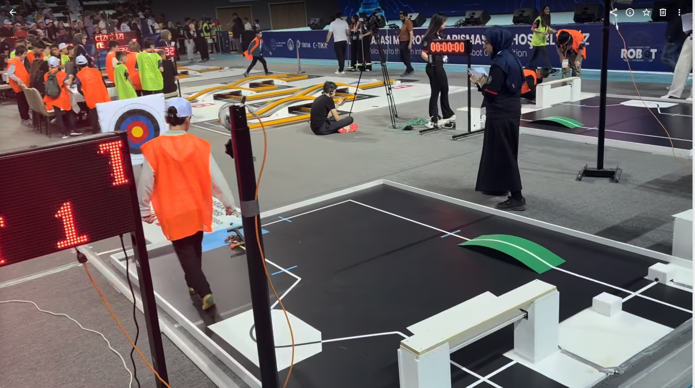

# Tozkoparan Robot 2026 — MEB Robot Contest

> **Team:** Avci-Tozkoparan  
> **Event:** 2026 Turkish Ministry of Education (MEB) Autonomous Robot Competition  
> **Platform:** Arduino Uno / Nano (ATmega328P)

---

## Overview

This repository contains the firmware for **Tozkoparan**, an autonomous line-following robot designed for the 2026 MEB Robot Contest. The robot navigates a multi-stage track using PID line following, color-based event detection, and a servo-triggered ball-launching mechanism.

The codebase is built around a **finite state machine** that transitions through distinct track phases:

1. **Start Line** — White line on black floor (PID follow)
2. **Dalga (Wavy Line)** — Black line on white floor (switched PID follow)
3. **After Dalga** — Return to white line
4. **Turquoise Shoot** — Detect turquoise zone, stop, and fire the ball launcher
5. **Search Line** — Reacquire the line after the shooting maneuver
6. **After Shot Line** — Resume white-line PID follow
7. **Green Bridge** — Detect green zone, climb a ramp with boosted motor power
8. **Finish** — Cross the finish line, stop, and run a victory LED animation




---

## Hardware

| Component | Purpose |
|-----------|---------|
| **Arduino Uno/Nano** | Main controller |
| **QTR-4A Reflectance Sensor** | 4-channel analog line sensing |
| **TCS34725 Color Sensor** | Turquoise / green zone detection |
| **L298N Dual Motor Driver** | Drive two DC motors (independent PWM + direction) |
| **MG90S / SG90 Servo** | Ball-launching trigger (arbalet) |
| **Laser Diode** | Aiming indicator before shot |
| **MZ80 Proximity Sensor** | Start trigger (waits for hand/object to begin race) |
| **WS2812B NeoPixel (8 LEDs)** | Status / state feedback |
| **DIP Switch** | Toggle between **Pist-A** and **Pist-B** track modes |

### Pinout

| Pin | Function |
|-----|----------|
| D2  | MZ80 start trigger |
| D3  | Servo (arbalet) |
| D4  | Laser |
| D5  | NeoPixel data |
| D6  | Motor R PWM |
| D7  | Motor R Dir 1 |
| D8  | Motor R Dir 2 |
| D9  | Motor L Dir 2 |
| D10 | Motor L Dir 1 |
| D11 | Motor L PWM |
| D12 | DIP switch (Pist A/B) |
| A0–A3 | QTR-4A sensors |

---

## State Machine

```text
START_LINE ──► DALGASI ──► AFTER_DALGASI ──► TURQUOISE_SHOOT
                                                    │
                                                    ▼
FINISH ◄── GREEN_BRIDGE ◄── AFTER_SHOT_LINE ◄── SEARCH_LINE
```

- **State transitions** require multiple consecutive sensor frames (`STATE_CHANGE_FRAMES`) to avoid false triggers.
- Each state uses the correct `readLineWhite()` or `readLineBlack()` method based on floor/line contrast.

---

## Key Features

- **Smoothed PID control** — Tunable `Kp` and `Kd` with single-sensor-read-per-loop design to reduce jitter.
- **Dual track support** — DIP switch selects **Pist-A** (single 90° turn after shot) or **Pist-B** (4 additional square-pattern turns).
- **Pre-race calibration** — 3-second pause to position the robot, followed by automatic 45°/90° turn calibration of QTR sensors.
- **Ramp climb boost** — On green bridge detection, a short `MAX_SPEED` burst provides kinetic energy to ascend the incline.
- **Rainbow finish animation** — NeoPixel victory celebration on race completion.

---

## Dependencies

Install the following libraries via **Arduino Library Manager**:

- `QTRSensors` (Pololu)
- `Adafruit TCS34725`
- `Adafruit NeoPixel`
- `Servo` (built-in)

---

## Build & Upload

1. Open `2026_Meb_Contest_Tozkoparan.ino` in **Arduino IDE** (or VS Code + PlatformIO).
2. Select your board: **Tools → Board → Arduino Uno** (or Nano).
3. Select the correct **Port**.
4. Click **Upload**.

> **Note:** Ensure the `.ino` filename matches the enclosing folder name (`2026_Meb_Contest_Tozkoparan`), as required by the Arduino IDE.

---

## Tuning Guide

| Parameter | Description | Typical Range |
|-----------|-------------|---------------|
| `Kp` | Proportional gain | 0.05 – 0.12 |
| `Kd` | Derivative gain | 0.5 – 1.2 |
| `BASE_SPEED` | Normal cruising PWM | 60 – 90 |
| `MAX_SPEED` | Max PWM (ramps / boosts) | 160 – 255 |
| `TURN_SPEED` | 90° pivot speed | 80 – 120 |
| `CALIB_SPEED` | Calibration rotation speed | 50 – 80 |

If the robot **oscillates** (shakes left/right), lower `Kp` or raise `Kd`.  
If it **fails to turn sharply**, raise `Kp`.

---

## Serial Diagnostics

Connect at **9600 baud** to monitor state transitions, sensor values, and PID debug output:

```text
==========================
TOZKOPARAN 2026 v5
==========================
OK: TCS34725
MODE: PIST-A
Pause 3 sec - place robot on white line
CALIBRATION...
>>> START <<<
State 1: START_LINE
```

---

## License

This project is shared for educational and competition reference purposes.

---

## Authors

- **Selman Tayyar** — Firmware & strategy
- **Team Archern**

> _Good luck on the track! 🤖_